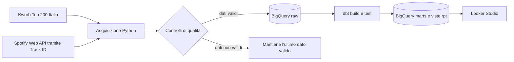

# Spotify Italy Analytics

Piattaforma analitica aggiornata quotidianamente sulla Top 200 Spotify Italia. Il
progetto combina acquisizione deterministica dei metadati Spotify, modelli storici dbt,
controlli di qualità, viste BigQuery dedicate al reporting e una dashboard interattiva
in Looker Studio.

[](https://github.com/ludovicofonti/Portfolio_Ludovico_Fonti/actions/workflows/spotify-ci.yml)
[](https://github.com/ludovicofonti/Portfolio_Ludovico_Fonti/actions/workflows/spotify-update-data.yml)


## Dashboard

[**Apri il report interattivo in Looker Studio →**](https://datastudio.google.com/reporting/33349080-c859-45c9-859f-23671c6b0cc8)

GitHub non consente di incorporare report interattivi di terze parti nel Markdown,
quindi la dashboard è collegata direttamente. Looker Studio legge le viste di reporting
in BigQuery: non esistono esportazioni CSV, un secondo database analitico o un livello
di pubblicazione duplicato da mantenere.

| Ultimo snapshot verificato | Copertura metadati | Warehouse di pubblicazione |
| ---: | ---: | ---: |
| 200 posizioni in classifica | 199/200 · 99,5% | BigQuery |

La [guida alla dashboard](docs/dashboard_guide.md) descrive ogni indicatore e grafico,
specificando domanda di business, vista BigQuery, dimensioni, metriche e criteri di
interpretazione.

## Obiettivo di business

Quali caratteristiche rendono un brano resiliente nella Top 200 italiana? Quali
artisti, release e cataloghi stanno guadagnando o perdendo attenzione? Il progetto
trasforma osservazioni giornaliere di posizione e stream in segnali utili per decisioni
di marketing, catalogo e A&R:

- concentrazione del mercato;
- quota e ampiezza del catalogo degli artisti;
- peso delle nuove uscite rispetto al catalogo consolidato;
- intensità, longevità e fase del ciclo di vita dei brani.

## Architettura



GitHub Actions esegue il percorso di produzione ogni giorno e si autentica su Google
Cloud tramite Workload Identity Federation. BigQuery è sia il data warehouse sia la
sorgente di pubblicazione. Airflow, dlt e PostgreSQL costituiscono un laboratorio locale
opzionale e non sono dipendenze della produzione.

## Controlli di produzione

- Il Track ID presente su Kworb è la chiave canonica; l'arricchimento usa
  `GET /tracks/{id}` e non il matching testuale.
- I metadati sono memorizzati in cache; le richieste applicano backoff esponenziale,
  jitter e rispetto dell'header `Retry-After`.
- La pipeline si interrompe con meno di 190 righe, chiavi mancanti, duplicati di
  posizione o granularità, oppure copertura metadati inferiore al 95%.
- Gli snapshot sono append-only alla granularità
  `chart_date + country + track_id`.
- Test Python, test dbt e CI impediscono la pubblicazione di dati parziali.
- Le partizioni raw scadono dopo 365 giorni e le viste di reporting espongono soltanto
  i campi necessari alle visualizzazioni.

## Livello di reporting

Looker Studio deve collegarsi alle viste seguenti nel dataset
`spotify_analytics_marts`, evitando l'uso diretto dei mart tecnici:

| Vista | Utilizzo nella dashboard |
| --- | --- |
| `rpt_market_overview_daily` | KPI esecutivi, andamento Top 200 e mix per anzianità della release |
| `rpt_artist_performance_daily` | Classifica artisti, quota di mercato e ampiezza catalogo |
| `rpt_track_opportunities_daily` | Intensità, longevità e segnali operativi dei brani |
| `rpt_release_performance_daily` | Coorti di release e collaborazioni |
| `rpt_chart_flow_daily` | Entrate e uscite dalla classifica |
| `rpt_track_lifecycle` | Picco, persistenza e stato corrente del ciclo di vita |
| `rpt_pipeline_health_daily` | Freschezza, copertura e stato della pipeline |

Il repository contiene esclusivamente snapshot osservati: non presenta backfill
sintetici come dati storici reali. Granularità, ownership e regole di qualità sono
documentate nel [catalogo dati](docs/spotify_data_catalog.md).

## Esecuzione locale

Costruzione dei modelli BigQuery utilizzando gli snapshot già presenti:

```powershell
python -m pip install -r requirements-dev.txt
python scripts/run_public_pipeline.py --skip-extract
```

Aggiornamento completo:

```powershell
python scripts/run_public_pipeline.py
```

L'aggiornamento completo richiede `SPOTIFY_CLIENT_ID`,
`SPOTIFY_CLIENT_SECRET`, le Application Default Credentials di Google e
`GCP_PROJECT_ID`. `BIGQUERY_LOCATION` usa `EU` come valore predefinito. Il loader
crea i quattro dataset `spotify_analytics_*` e le tabelle raw se non esistono.

Laboratorio locale Airflow/PostgreSQL:

```powershell
docker compose up -d postgres redis airflow-init airflow-apiserver airflow-scheduler
```

## Configurazione GitHub Actions

La schedulazione giornaliera rimane in
`.github/workflows/spotify-update-data.yml`.

| Tipo | Nome | Scopo |
| --- | --- | --- |
| Variabile | `GCP_PROJECT_ID` | Progetto Google Cloud contenente i dataset Spotify |
| Variabile | `GCP_WORKLOAD_IDENTITY_PROVIDER` | Resource name del provider WIF |
| Variabile | `GCP_SPOTIFY_SERVICE_ACCOUNT` | Service account dedicato alla pipeline Spotify |
| Variabile | `BIGQUERY_LOCATION` | Località dei dataset BigQuery, normalmente `EU` |
| Segreto | `SPOTIFY_CLIENT_ID` | Autenticazione Spotify Client Credentials |
| Segreto | `SPOTIFY_CLIENT_SECRET` | Autenticazione Spotify Client Credentials |

Nessuna chiave JSON di service account viene salvata su GitHub. Il workflow usa
credenziali WIF temporanee e non esegue deploy su GitHub Pages.

## Verifiche di qualità

```powershell
ruff check dlt scripts tests airflow/dags
pytest
dbt parse --project-dir dbt --profiles-dir dbt --target bigquery --no-partial-parse
```

La suite verifica parsing, retry, controlli di pubblicazione, unicità della granularità
e delle posizioni giornaliere, intervalli validi di rank e stream, date future,
coerenza del ciclo di vita e completezza dei metadati.

## Fonti e limitazioni

- [Kworb Spotify Italy Daily](https://kworb.net/spotify/country/it_daily.html) fornisce
  posizione e stream osservati.
- Spotify Web API fornisce metadati di brano, artista e album; link e immagini
  mantengono l'attribuzione alla sorgente.
- Il progetto non è affiliato a Spotify e non usa contenuti Spotify per addestrare
  modelli di intelligenza artificiale o machine learning.
- La profondità storica parte dal primo snapshot acquisito.
- Le audio feature non disponibili alle nuove applicazioni Spotify sono escluse.

## Struttura del repository

| Percorso | Ruolo |
| --- | --- |
| `scripts/` | Acquisizione validata, caricamento BigQuery e orchestrazione |
| `dbt/` | Staging, intermediate, mart e viste di reporting con test dati |
| `tests/` | Test di regressione offline e fixture della sorgente |
| `airflow/`, `dlt/` | Laboratorio locale opzionale di orchestrazione e ingestione |
| [`docs/dashboard_guide.md`](docs/dashboard_guide.md) | Domande, campi e interpretazione della dashboard |
| [`docs/spotify_data_catalog.md`](docs/spotify_data_catalog.md) | Fonti, granularità, ownership e limitazioni |

`requirements.txt` contiene le dipendenze runtime. `requirements-dev.txt` aggiunge
test, copertura, lint e pre-commit. Le credenziali non sono versionate e devono essere
fornite tramite variabili d'ambiente, Application Default Credentials o impostazioni
del repository GitHub.
