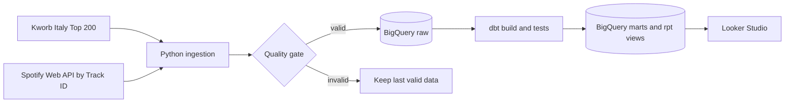

# Spotify Italy Analytics

Daily, production-style analytics on the Spotify Italy Top 200. The project combines
deterministic Spotify metadata matching, historical dbt models, data-quality gates,
BigQuery reporting views and a shared Looker Studio report.

[](https://github.com/ludovicofonti/Portfolio_Ludovico_Fonti/actions/workflows/spotify-ci.yml)
[](https://github.com/ludovicofonti/Portfolio_Ludovico_Fonti/actions/workflows/spotify-update-data.yml)


## Live dashboard

[**Open the interactive Looker Studio report →**](https://datastudio.google.com/s/lDpEXFyep90)

GitHub does not render third-party interactive iframes, so the report is linked rather
than embedded. The dashboard reads the BigQuery reporting views directly; there is no
CSV publication layer or duplicate analytical database.

The current share URL redirects anonymous sessions to Google sign-in. Before sending
the portfolio to recruiters, set the report's viewer access to “Anyone with the link”
or add exported screenshots to this section.

| Current verified snapshot | Metadata coverage | Publication warehouse |
| ---: | ---: | ---: |
| 200 chart positions | 199/200 · 99.5% | BigQuery |

The [dashboard guide](docs/dashboard_guide.md) documents every visible scorecard and
chart, including its business question, Looker Studio fields and interpretation.

## Business objective

What makes a track resilient in Italy's Top 200, and which artists, releases and
catalogue bets are gaining or losing attention? The report turns daily rank and stream
observations into market concentration, artist share, release-stage and longevity
signals for catalogue, marketing and A&R decisions.

## Architecture



GitHub Actions runs the production path daily and authenticates to Google Cloud through
Workload Identity Federation. BigQuery is both the warehouse and publication source.
The optional local Airflow, dlt and PostgreSQL stack is an engineering lab, not a
production dependency.

## Production controls

- Kworb's Spotify Track ID is the canonical key; enrichment uses
  `GET /tracks/{id}`, not fuzzy search.
- Metadata is cached and requests use bounded exponential backoff, jitter and
  `Retry-After`.
- A refresh stops below 190 chart rows, on missing keys, duplicate grains/ranks or
  metadata coverage below 95%.
- Snapshots are append-only at `chart_date + country + track_id`; dbt builds the
  historical fact and reusable marts.
- Python tests, dbt data tests and CI run without publishing partial dashboard data.
- Raw BigQuery partitions expire after 365 days and reporting views expose only the
  fields required by Looker Studio.

## Reporting layer

Looker Studio should connect to these purpose-built views in
`spotify_analytics_marts`, rather than to the lower-level marts:

| Reporting view | Dashboard use |
| --- | --- |
| `rpt_market_overview_daily` | Executive KPIs, Top 200 trend and release-stage mix |
| `rpt_artist_performance_daily` | Artist ranking, market share and catalogue breadth |
| `rpt_track_opportunities_daily` | Track intensity, longevity and action signals |
| `rpt_release_performance_daily` | Release cohorts and collaboration analysis |
| `rpt_chart_flow_daily` | Entries and exits |
| `rpt_track_lifecycle` | Peak, persistence and current lifecycle state |
| `rpt_pipeline_health_daily` | Freshness, coverage and pipeline status |

The repository contains only observed snapshots. It never presents synthetic backfill
as observed history. See the [data catalog](docs/spotify_data_catalog.md) for grains,
ownership and quality rules.

## Run locally

Build BigQuery models from existing raw snapshots:

```powershell
python -m pip install -r requirements-dev.txt
python scripts/run_public_pipeline.py --skip-extract
```

Run a full refresh:

```powershell
python scripts/run_public_pipeline.py
```

The full refresh requires `SPOTIFY_CLIENT_ID`, `SPOTIFY_CLIENT_SECRET`, Google
Application Default Credentials and `GCP_PROJECT_ID`. `BIGQUERY_LOCATION` defaults
to `EU`. The loader creates the four `spotify_analytics_*` datasets and raw tables
when they do not exist.

Optional local Airflow/PostgreSQL lab:

```powershell
docker compose up -d postgres redis airflow-init airflow-apiserver airflow-scheduler
```

## GitHub Actions configuration

The daily schedule remains in `.github/workflows/spotify-update-data.yml`.

| Type | Name | Purpose |
| --- | --- | --- |
| Variable | `GCP_PROJECT_ID` | Google Cloud project containing the Spotify datasets |
| Variable | `GCP_WORKLOAD_IDENTITY_PROVIDER` | WIF provider resource name |
| Variable | `GCP_SPOTIFY_SERVICE_ACCOUNT` | Spotify-only pipeline service account |
| Variable | `BIGQUERY_LOCATION` | BigQuery dataset location, normally `EU` |
| Secret | `SPOTIFY_CLIENT_ID` | Spotify Client Credentials authentication |
| Secret | `SPOTIFY_CLIENT_SECRET` | Spotify Client Credentials authentication |

No Google service-account key is stored in GitHub. The workflow uses short-lived WIF
credentials and does not deploy a GitHub Pages application.

## Quality checks

```powershell
ruff check dlt scripts tests airflow/dags
pytest
dbt parse --project-dir dbt --profiles-dir dbt --target bigquery --no-partial-parse
```

The suite validates parsing, retries, publication gates, unique chart grain, unique
daily ranks, rank and stream ranges, non-future dates, peak consistency and metadata
completeness.

## Sources and limitations

- [Kworb Spotify Italy Daily](https://kworb.net/spotify/country/it_daily.html) supplies
  chart position and stream observations.
- Spotify Web API supplies track, artist and album metadata; Spotify links and artwork
  retain source attribution.
- The project is not affiliated with Spotify and does not use Spotify content to train
  AI or machine-learning models.
- Historical depth starts with the first collected snapshot.
- Audio features unavailable to newer Spotify applications are intentionally excluded.

## Repository guide

| Path | Role |
| --- | --- |
| `scripts/` | Validated extraction, BigQuery loading and orchestration |
| `dbt/` | Staging, intermediate, marts and reporting views with data tests |
| `tests/` | Offline regression tests and saved source fixture |
| `airflow/`, `dlt/` | Optional local orchestration and ingestion lab |
| [`docs/dashboard_guide.md`](docs/dashboard_guide.md) | Dashboard questions, fields and interpretation |
| [`docs/spotify_data_catalog.md`](docs/spotify_data_catalog.md) | Sources, grains, ownership and limitations |

`requirements.txt` is the single runtime dependency set. `requirements-dev.txt`
extends it with test, coverage, lint and pre-commit tooling. Credentials are excluded
and must be supplied through environment variables, Application Default Credentials or
GitHub repository settings.
