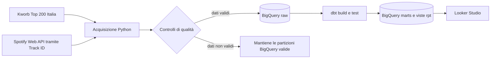

# Spotify Italy Analytics

Piattaforma analitica aggiornata quotidianamente sulla Top 200 Spotify Italia. Il
progetto combina acquisizione deterministica dei metadati Spotify, modelli storici dbt,
controlli di qualità, viste BigQuery dedicate al reporting e una dashboard interattiva
in Looker Studio.

## Dashboard

[**Apri il report interattivo in Looker Studio →**](https://datastudio.google.com/reporting/33349080-c859-45c9-859f-23671c6b0cc8)

La [guida alla dashboard](docs/dashboard_guide.md) descrive ogni indicatore e grafico,
specificando domanda di business, vista BigQuery, dimensioni, metriche e criteri di
interpretazione.

## Obiettivo di business

Quali caratteristiche rendono un brano resiliente nella Top 200 italiana? Quali
artisti, release e cataloghi stanno guadagnando o perdendo attenzione? Il progetto
trasforma osservazioni giornaliere di posizione e stream in segnali utili per decisioni
di marketing, catalogo e A&R:

- concentrazione del mercato;
- quota e ampiezza del catalogo degli artisti;
- peso delle nuove uscite rispetto al catalogo consolidato;
- intensità, longevità e fase del ciclo di vita dei brani.

## Architettura

GitHub Actions esegue il percorso di produzione ogni giorno e si autentica su Google
Cloud tramite Workload Identity Federation. BigQuery è sia il data warehouse sia la
sorgente di pubblicazione e riceve i dati direttamente in memoria dalla pipeline.

## Controlli di produzione

- Il Track ID presente su Kworb è la chiave canonica; l'arricchimento usa
  `GET /tracks/{id}` e non il matching testuale.
- I metadati sono memorizzati in cache; le richieste applicano backoff esponenziale,
  jitter e rispetto dell'header `Retry-After`.
- La pipeline si interrompe con meno di 190 righe, chiavi mancanti, duplicati di
  posizione o granularità, oppure copertura metadati inferiore al 95%.
- Le partizioni BigQuery sono aggiornate atomicamente alla granularità
  `chart_date + country + track_id`.
- Test Python, test dbt e CI impediscono la pubblicazione di dati parziali.
- Le partizioni raw scadono dopo 365 giorni e le viste di reporting espongono soltanto
  i campi necessari alle visualizzazioni.

## Livello di reporting

Looker Studio deve collegarsi alle viste seguenti nel dataset
`spotify_analytics_marts`, evitando l'uso diretto dei mart tecnici:

| Vista | Utilizzo nella dashboard |
| --- | --- |
| `rpt_market_overview_daily` | KPI esecutivi, andamento Top 200 e mix per anzianità della release |
| `rpt_artist_performance_daily` | Classifica artisti, quota di mercato e ampiezza catalogo |
| `rpt_track_opportunities_daily` | Intensità, longevità e segnali operativi dei brani |
| `rpt_release_performance_daily` | Coorti di release e collaborazioni |
| `rpt_chart_flow_daily` | Entrate e uscite dalla classifica |
| `rpt_track_lifecycle` | Picco, persistenza e stato corrente del ciclo di vita |
| `rpt_pipeline_health_daily` | Freschezza, copertura e stato della pipeline |

BigQuery contiene esclusivamente osservazioni reali e non presenta backfill sintetici
come dati storici. Granularità, ownership e regole di qualità sono documentate nel
[catalogo dati](docs/spotify_data_catalog.md).

## Esecuzione online

Il progetto viene eseguito esclusivamente tramite GitHub Actions:

- `spotify-update-data.yml` acquisisce la Top 200, arricchisce i Track ID tramite
  Spotify, sostituisce la sola partizione giornaliera in BigQuery ed esegue dbt;
- `spotify-ci.yml` esegue lint, test Python e parsing del progetto dbt a ogni pull
  request e push su `main`.

`requirements.txt` contiene soltanto le dipendenze runtime installate dal job
giornaliero. `requirements-ci.txt` aggiunge pytest, coverage e Ruff per il job di
qualità. Questa separazione evita di installare strumenti di test durante ogni
aggiornamento dei dati.

La cache dei metadati Spotify e le metriche delle esecuzioni sono tabelle BigQuery nel
dataset raw. GitHub Actions usa soltanto memoria e filesystem temporaneo del runner e
non effettua commit automatici di dati nel repository.

## Configurazione GitHub Actions

La schedulazione giornaliera rimane in
`.github/workflows/spotify-update-data.yml`.

| Tipo | Nome | Scopo |
| --- | --- | --- |
| Variabile | `GCP_PROJECT_ID` | Progetto Google Cloud contenente i dataset Spotify |
| Variabile | `GCP_WORKLOAD_IDENTITY_PROVIDER` | Resource name del provider WIF |
| Variabile | `GCP_SPOTIFY_SERVICE_ACCOUNT` | Service account dedicato alla pipeline Spotify |
| Variabile | `BIGQUERY_LOCATION` | Località dei dataset BigQuery, normalmente `EU` |
| Segreto | `SPOTIFY_CLIENT_ID` | Autenticazione Spotify Client Credentials |
| Segreto | `SPOTIFY_CLIENT_SECRET` | Autenticazione Spotify Client Credentials |

Nessuna chiave JSON di service account viene salvata su GitHub. Il workflow usa
credenziali WIF temporanee e non esegue deploy su GitHub Pages.

## Verifiche di qualità

Il workflow CI esegue automaticamente:

- Ruff su `scripts/` e `tests/`;
- test Python con soglia minima di copertura;
- parsing completo del progetto dbt con adapter BigQuery.

La suite verifica parsing, retry, controlli di pubblicazione, unicità della granularità
e delle posizioni giornaliere, intervalli validi di rank e stream, date future,
coerenza del ciclo di vita e completezza dei metadati.

## Fonti e limitazioni

- [Kworb Spotify Italy Daily](https://kworb.net/spotify/country/it_daily.html) fornisce
  posizione e stream osservati.
- Spotify Web API fornisce metadati di brano, artista e album; link e immagini
  mantengono l'attribuzione alla sorgente.
- Il progetto non è affiliato a Spotify e non usa contenuti Spotify per addestrare
  modelli di intelligenza artificiale o machine learning.
- La profondità storica parte dal primo snapshot acquisito.
- Le audio feature non disponibili alle nuove applicazioni Spotify sono escluse.

## Struttura del repository

| Percorso | Ruolo |
| --- | --- |
| `scripts/` | Acquisizione validata, caricamento BigQuery e orchestrazione |
| `dbt/` | Staging, intermediate, mart e viste di reporting con test dati |
| `tests/` | Test di regressione eseguiti dalla CI e fixture della sorgente |
| [`docs/dashboard_guide.md`](docs/dashboard_guide.md) | Domande, campi e interpretazione della dashboard |
| [`docs/spotify_data_catalog.md`](docs/spotify_data_catalog.md) | Fonti, granularità, ownership e limitazioni |

Le credenziali non sono versionate: vengono fornite esclusivamente dai secret e dalle
variabili GitHub, mentre Google Cloud usa credenziali WIF temporanee.
