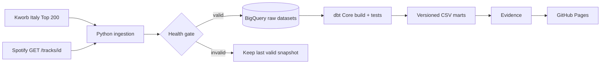
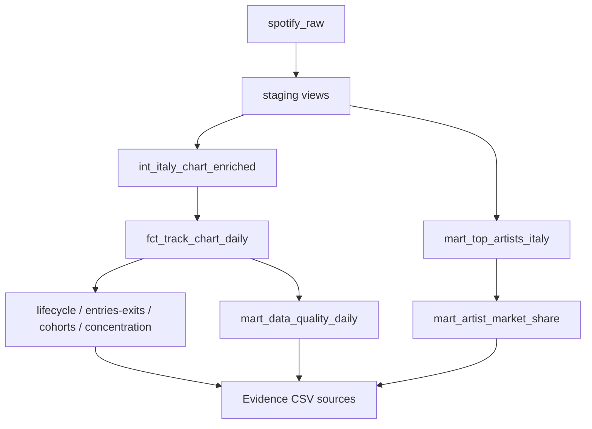

# Spotify Italy Analytics

Daily, production-style analytics on the Spotify Italy Top 200: deterministic Spotify metadata matching, historical dbt models, data-quality gates and a public Evidence dashboard.

[](https://github.com/ludovicofonti/Portfolio_Ludovico_Fonti/actions/workflows/spotify-ci.yml)
[](https://github.com/ludovicofonti/Portfolio_Ludovico_Fonti/actions/workflows/spotify-update-data.yml)


[**View live dashboard →**](https://ludovicofonti.github.io/Portfolio_Ludovico_Fonti/)

| Current verified snapshot | Metadata coverage | Warehouse |
| ---: | ---: | ---: |
| 200 chart positions | 199/200 · 99.5% | BigQuery |

## The business question

What makes a track resilient in Italy's Top 200—and which artists, releases and catalogue bets are gaining or losing attention? The dashboard turns daily rank and stream observations into market concentration, momentum, lifecycle, release-cohort and artist-share signals.

## Architecture



The production path runs daily on GitHub Actions, authenticates to Google Cloud through Workload Identity Federation, loads partitioned BigQuery raw tables and executes `dbt-bigquery`. The local engineering lab keeps Airflow, dlt and PostgreSQL as a separate orchestration demonstration:

```text
extract -> validate_raw -> dbt_build -> validate_marts -> publish_metadata
```

## What is production-oriented here

- Kworb's Spotify Track ID is the canonical key; enrichment uses `GET /v1/tracks/{id}`, not fuzzy search.
- Persistent metadata cache plus bounded exponential backoff, jitter and `Retry-After` support.
- Publication stops below 190 chart rows, on missing keys, duplicate grains/ranks or metadata coverage below 95%.
- Snapshots are append-only at `chart_date + country + track_id`; dbt builds an incremental daily fact.
- 42 dbt data tests plus offline Python tests cover parsing, edge cases, retries and publication gates.
- Atomic CSV writes preserve the last valid public datasets when a run fails.

## Analytics models

| Model | Purpose |
| --- | --- |
| `fct_track_chart_daily` | Incremental historical chart fact |
| `mart_chart_entries_exits` | New entries and exits between observations |
| `mart_track_lifecycle` | Peak, persistence and lifecycle status |
| `mart_artist_market_share` | Artist stream share and rank |
| `mart_release_cohorts` | Release-month cohort performance |
| `mart_chart_concentration` | Top 10/50 stream concentration |
| `mart_data_quality_daily` | Completeness, match rate and pipeline health |

The repository contains only observed daily snapshots. The pipeline accumulates history without fabricating backfill, so every trend shown in the dashboard is traceable to a collected chart date.

## Data lineage



## Run locally

Public pipeline from existing raw data (requires Google Application Default Credentials):

```powershell
python -m pip install -r requirements-dev.txt
python scripts/run_public_pipeline.py --skip-extract
cd evidence
npm ci
npm run sources
npm run dev
```

Full daily refresh requires `SPOTIFY_CLIENT_ID` and `SPOTIFY_CLIENT_SECRET`:

```powershell
python scripts/run_public_pipeline.py
```

The BigQuery path also requires Google Application Default Credentials plus
`GCP_PROJECT_ID`; `BIGQUERY_LOCATION` defaults to `EU`. The pipeline creates the four
`spotify_analytics_*` datasets and their raw tables when they do not already exist.

Local Airflow/PostgreSQL environment:

```powershell
docker compose up -d postgres redis airflow-init airflow-apiserver airflow-scheduler
```

## GitHub Actions configuration

The daily schedule remains in `.github/workflows/spotify-update-data.yml`. GitHub must
contain these repository settings:

| Type | Name | Purpose |
| --- | --- | --- |
| Variable | `GCP_PROJECT_ID` | Google Cloud project that owns the Spotify datasets |
| Variable | `GCP_WORKLOAD_IDENTITY_PROVIDER` | Workload Identity Federation provider resource name |
| Variable | `GCP_SPOTIFY_SERVICE_ACCOUNT` | Spotify-only deployment service account |
| Variable | `BIGQUERY_LOCATION` | Dataset location, normally `EU` |
| Secret | `SPOTIFY_CLIENT_ID` | Spotify Client Credentials authentication |
| Secret | `SPOTIFY_CLIENT_SECRET` | Spotify Client Credentials authentication |

No Google service-account key is stored in GitHub. The workflow uses short-lived WIF
credentials; the service account is restricted to the Spotify BigQuery datasets.

## Quality checks

```powershell
ruff check dlt scripts tests airflow/dags
pytest
dbt parse --project-dir dbt --profiles-dir dbt --target bigquery --no-partial-parse
```

The Python suite is network-free and uses a saved Kworb HTML fixture. dbt validates unique chart grain, unique daily ranks, rank/stream ranges, non-future dates, peak consistency and metadata completeness.

## Sources, governance and limitations

- [Kworb](https://kworb.net/spotify/country/it_daily.html) supplies chart position and stream observations.
- Spotify Web API supplies track, artist and album metadata. Spotify links and artwork retain source attribution.
- The project is not affiliated with Spotify and does not use Spotify content to train AI or ML models.
- Historical analysis is only as deep as the collected snapshots; no synthetic history is presented as observed data.
- Audio features unavailable to newer Spotify applications are intentionally excluded.

## Cost and trade-offs

The public architecture uses GitHub Actions, BigQuery, dbt Core, Evidence and GitHub Pages. Raw partitions expire after 365 days; queries and Evidence exports have bounded scan limits; resource labels isolate project cost. PostgreSQL and Airflow remain local and are not production dependencies. BigQuery may remain within its free tier at this data volume, but billing alerts and least-privilege IAM are still required.

## Repository guide

| Path | Role |
| --- | --- |
| `scripts/` | BigQuery ingestion, orchestration and bounded Evidence exports |
| `dbt/` | Staging, intermediate and analytics models with data tests |
| `evidence/` | Public dashboard application and versioned CSV inputs |
| `airflow/`, `dlt/` | Optional local orchestration and PostgreSQL engineering lab |
| [`docs/spotify_data_catalog.md`](docs/spotify_data_catalog.md) | Sources, grains, ownership, quality rules and limitations |

`requirements.txt` is the single runtime dependency set for both publication and the
local lab. `requirements-dev.txt` extends it with test, coverage, lint and pre-commit
tooling. Credentials are intentionally excluded and must be supplied through environment
variables, Application Default Credentials or GitHub repository settings.
